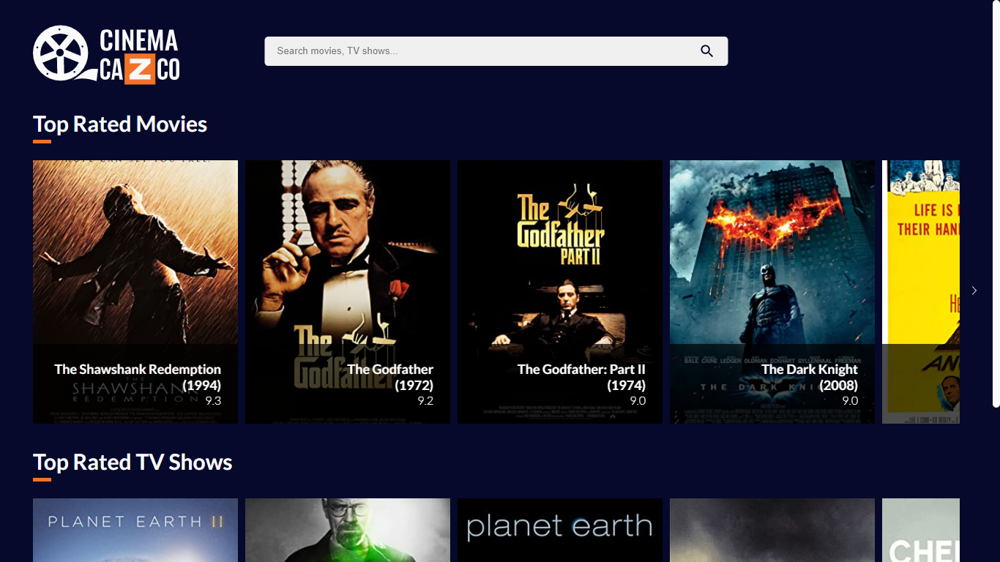
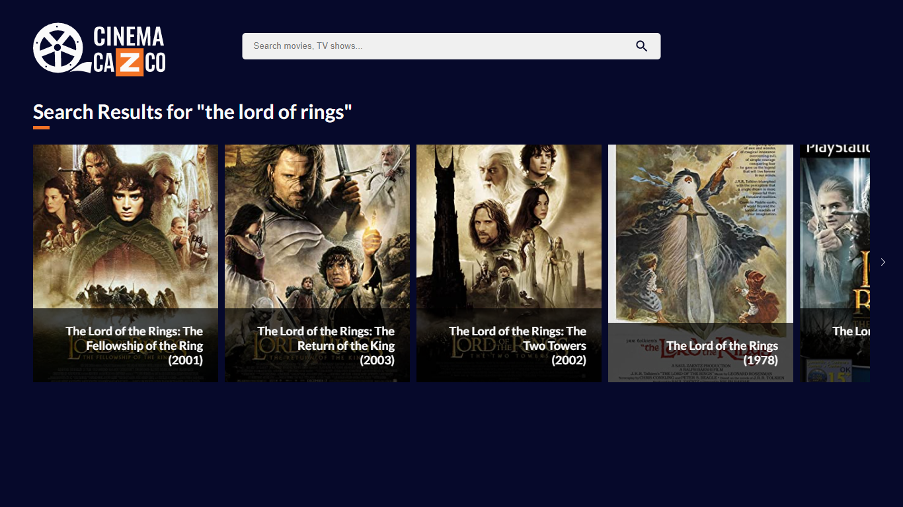
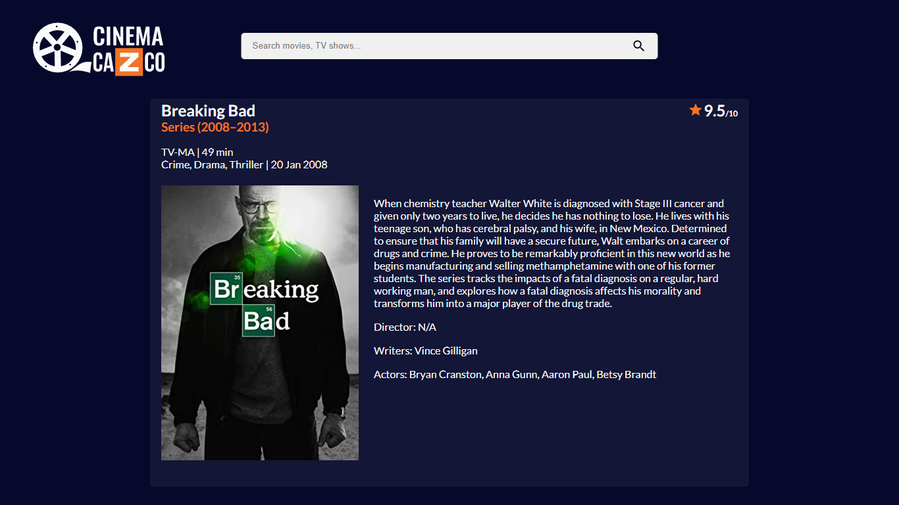
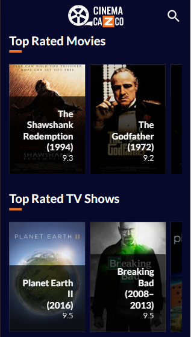
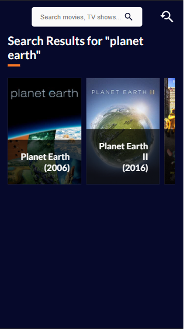
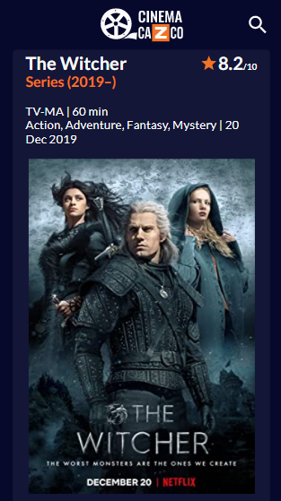

<h1 align="center">
   Cinema Cazco
</h1>

<p align="center">
  Cinema Cazco is an application where you can get ratings, images and more about your favorite movies and tv series!
</p>

<hr />

<p align="center">In this project, I practiced very important concepts from ReactJS, like React Router, React Hooks, React Components, Typescript, Axios, Styled Components and more.
</p>

<div align="center">
  <sub> Made with 💖 by
    <a href="https://github.com/guilhpupo">Guilherme Pupo
  </sub>
</div>

# 📌 Contents

- [Screenshots](#camera-screenshots)
- [Technologies](#rocket-technologies)
- [How to Run](#computer-how-to-run)
- [Commands](#sparkles-commands)
- [Issues](#bug-issues)
- [License](#page_facing_up-license)

# :camera: Screenshots

<h2>Desktop (1366x768)</h2>
<div align="center" display="flex">
   
   
      
</div>

<h2>Mobo (375x667)</h2>
<div align="center" display="flex">
   
   
      
</div>

# :rocket: Technologies

This project was made using the follow technologies:


- [ReactJS](https://reactjs.org/)
- [React Router](https://reactrouter.com/)
- [React Icons](https://github.com/react-icons/react-icons)
- [TypeScript](https://www.typescriptlang.org/)
- [Styled Components](https://styled-components.com/)
- [Styled Media Query](https://github.com/morajabi/styled-media-query)
- [Axios](https://github.com/axios/axios)
- [Jest](https://jestjs.io/)
- [Testing Library](https://testing-library.com/)
- [Keen Slider](https://github.com/rcbyr/keen-slider)
- [ESLint](https://eslint.org/)
- [Prettier](https://prettier.io/)

# :computer: How to run

```bash
# Clone Repository
$ git clone https://github.com/guilhpupo/cinemaCazco && cd cinemaCazco
# Install Dependencies
$ yarn install
# Rename .env-sample to .env
$ rename .env-sample .env
# Get your own API Key on http://www.omdbapi.com/apikey.aspx and paste it on .env file
<a href="http://www.omdbapi.com/apikey.aspx ">Get your Free API Key</a>
# Run Aplication
$ yarn start
```

Go to http://localhost:3000/ to see the application running.

# :sparkles: Commands

- `start`: runs your application on `localhost:3000`
- `build`: creates the production build version
- `lint`: runs the linter in all components and pages
- `format`: runs the prettier in all components and pages
- `test`: runs jest to test all components and pages
- `test:watch`: runs jest in watch mode

# :bug: Issues

Create a <a href="https://github.com/guilhpupo/cazcoCinema/issues">new issue report</a>, it will be an honor to be able to help you solve and further improve our application.

# :page_facing_up: License

This project is under the [MIT License](./LICENSE) |
Made with 💖 by [Guilherme Pupo](https://www.linkedin.com/in/guilhpupo/).
